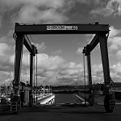

# Image Classification Project - Intel Scenes

## Overview
This project focuses on applying deep learning techniques for image classification of natural scenes using the Intel Image Classification Dataset. It was developed as a practical case for the **M9 module - Deep Learning Applied: NLP and Computer Vision** of the Master in Artificial Intelligence at IMF Smart Education.

## Dataset
The Intel Image Classification Dataset consists of approximately 25,000 images of natural scenes around the world, categorized into six classes:
- **Buildings**
- **Forest**
- **Glacier**
- **Mountain**
- **Sea**
- **Street**

Each image is 150x150 pixels. The dataset is split into:
- **Training**: ~14,000 images
- **Testing**: ~3,000 images
- **Prediction**: ~7,000 images

**Source**: Originally published by Intel on [Analytics Vidhya](https://datahack.analyticsvidhya.com) for an image classification challenge.

### Sample Images from Dataset
Below are placeholders for sample images from each category to give a visual representation of the dataset:

| Buildings | Forest | Glacier |
|-----------|--------|---------|
|  |  |  |

| Mountain | Sea | Street |
|----------|-----|--------|
|  |  |  |

## Project Objective
The main goal is to train deep neural networks (Convolutional Neural Networks - CNNs) to classify natural scenes with high accuracy, enhancing skills in computer vision and deep learning.

## Methodology
Several models were developed and compared:
1. **Base CNN**: A simple convolutional neural network as a baseline.
2. **Advanced CNN**: A deeper network with dropout and batch normalization for regularization.
3. **Hyperparameter Tuning**: Using Keras Tuner to find optimal hyperparameters for a CNN.
4. **Transfer Learning + Fine Tuning**: Utilizing a pre-trained model (MobileNetV2) for feature extraction followed by fine-tuning.
5. **Data Augmentation**: Applying random transformations to increase dataset diversity and prevent overfitting.

## Implementation Details
- **Environment**: Python with TensorFlow for model development.
- **Preprocessing**: Images resized to 150x150, normalized, and split into training, validation, and test sets.
- **Training**: Models trained with various configurations, using callbacks like Early Stopping and learning rate reduction on plateau.
- **Evaluation**: Performance compared based on validation and test accuracy.

## Results
The project evaluates the performance of each model on the test set, visualizing the training progress and prediction accuracy on sample images.

## Repository Structure
- `image-classification.py`: Main script containing all code for data processing, model creation, training, and evaluation.
- `models/`: Directory storing trained model files.
- `history/`: Directory with training history logs in JSON format.
- `data/`: Directory where dataset is stored after download and extraction.

## How to Run
1. Install dependencies: `pip install -r requirements.txt`
2. Follow the instruccions in the notebook.

## Author
Developed by Diego Cesar Lerma Torres for IMF Smart Education.

## Acknowledgments
Thanks to Intel and Analytics Vidhya for providing this dataset for the community.

---
*This project is part of the Master in Artificial Intelligence at IMF Smart Education.* 